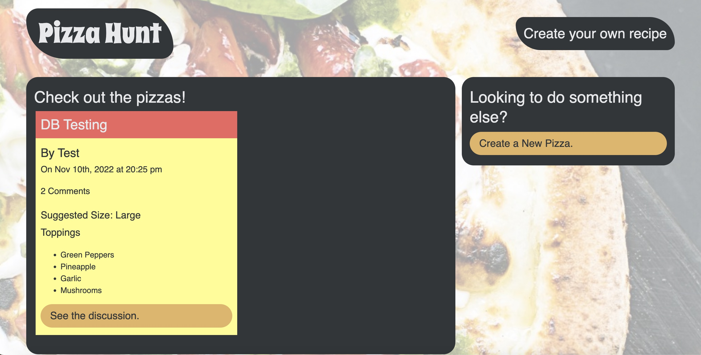

 [] 
# <h1 align="center">Pizza Hunt</h1>

<a href="https://pizzaz-hunt.herokuapp.com/">Visit the app here!</a>

 

## Description
A Dynamic JavaScript application for sharing and discussing pizza content using MongoDB, Mongoose ODM, and ExpressJS.

## Table of Contents
  - [Description](#description)
  - [Installation](#installation)
  - [Usage](#usage)
  - [License](#license)
  - [Contributors](#contributors)
  - [Questions](#questions)

## Installation
Copy this repository onto your local machine, install necessary packages, create a new mongoDB connection, run `node server` to start the application.

## Usage
A pizza blog for creating, sharing, and discussing your favorite pies!

## License
[]This application is covered under the MIT license. (https://opensource.org/licenses/MIT)

## Contributors
- expressJS (https://expressjs.com/)
- MongooseJS (https://mongoosejs.com/)
- MongoDB (https://www.mongodb.com/)

## Questions? Contact me:
GitHub: https://github.com/ejackson1228/  
Email: ejackson1228@gmail.com
